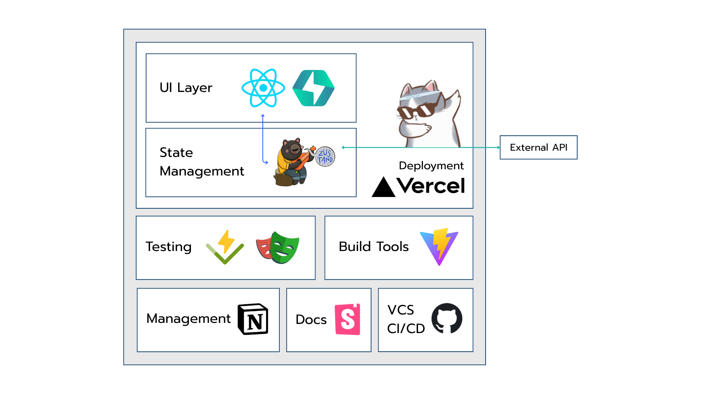

# Purrse - Your Furball Expense Tracker 🐱💰

A modern, responsive expense tracking application built with React, TypeScript, and Chakra UI. Purrse helps you manage your finances with a delightful cat-themed interface.

Production: [Link](https://purrse-expense.vercel.app/)

Storybook Production: [Link](https://meowkit-storybook.vercel.app/?path=/docs/meowkit-components-meowbutton--docs)

Task Breakdown & Planning: [Link](https://pichyapakh.notion.site/Cat-Expense-Web-21502ebb6c628020a4bbc1c9ddef73fa?source=copy_link)

## 🚀 Functionalities

### Core Features
- **Expense Management**: Add and delete expense entries
- **Data Table**: Allows pagination and column sorting
- **Search & Filter**: Global search across all expense data
- **Row Highlight**: Highlight the most spent category
- **Row Selection**: Multi-select rows for bulk delete
- **Responsive Design**: (Should) Works seamlessly on desktop, tablet, and mobile
- **Offline Support**: Fallback data when network is unavailable
- **Cats Facts**: Meow

### Developer Experience
- **Component Library**: Reusable UI components with Storybook
- **Type Safety**: Full TypeScript coverage
- **Testing**: Unit tests (Vitest) and E2E tests (Playwright)
- **CI/CD**: Pipeline with GitHub action, Deployment with Vercel
- **Code Quality**: ESLint, Prettier, and comprehensive linting rules

## 🏗️ System Architecture



### Technology Stack
- **Frontend Framework**: React 19 with TypeScript
- **UI Library**: Chakra UI v3 with custom theme
- **State Management**: Zustand for global state
- **Data Table**: TanStack Table for advanced table functionality
- **Build Tool**: Vite for fast development and optimized builds
- **Testing**: Vitest for unit tests, Playwright for E2E tests
- **Documentation**: Storybook for component documentation

## 📁 Repository Structure

```
purrse-expense/
├── src/
│   ├── app/                   # App-level Setup
│   │   ├── App.tsx            # Main app component
│   │   └── providers/         # Context providers
│   ├── modules/               # Feature-based modules 
│   │   └── expense/           # Expense tracking feature
│   │       ├── components/    # Expense-specific components
│   │       ├── pages/         # Pages
│   │       ├── stores/        # Expense-specific states
│   │       └── types/         # Expense-specific types
│   ├── common/                # Shared resources across modules
│   │   ├── ui/               # Reusable UI components
│   │   │   ├── base/         # Base components from ChakraUI
│   │   │   ├── components/   # Custom Components (Atom)
│   │   │   └── patterns/     # Complex UI patterns (Molecules)
│   │   ├── utils/            # Utility functions
│   │   ├── constants/        # Application constants
│   │   └── types/            # Shared types
│   └── test/                 
│       ├── e2e/              # e2e testing  
│       └── utils/            # testing utilities  
├── .github/workflows         # CI/CD Pipeline
├── public/                   # Static assets
└── .storybook/              # Storybook configuration
```

## 🚀 Getting Started

### Prerequisites
- Node.js 18+ 
- pnpm (recommended) or npm

### Installation
```bash
# Clone the repository
git clone https://github.com/QuadieZ/purrse-expense.git
cd purrse-expense

# Install dependencies
pnpm install
pnpm typegen:ui

# Start development server
pnpm dev
```

### Running Tests
```bash
# Run all tests
pnpm test

# Run tests with coverage
pnpm test:coverage

# Run E2E tests
pnpm test:e2e
```

### Component Development
```bash
# Start Storybook
pnpm storybook

# Build Storybook
pnpm build-storybook
```

## 🛠️ Available Scripts

### Development
```bash
# Start development server
pnpm dev

# Start development server with preview
pnpm preview
```

### Building
```bash
# Build for production
pnpm build

# Build Storybook
pnpm build-storybook
```

### Testing
```bash
# Run unit tests in watch mode
pnpm test

# Run unit tests with coverage
pnpm test:coverage

# Run E2E tests
pnpm test:e2e

# Run E2E tests with UI
pnpm playwright test --ui
```

### Code Quality
```bash
# Lint code
pnpm lint

# Start Storybook for component development
pnpm storybook
```

### Type Generation
```bash
# Generate Chakra UI types
pnpm typegen:ui
```

------

Made with ❤️ and 🐱 

No cats were harmed during the development of this website.
